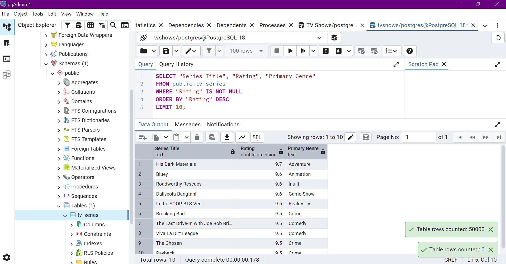
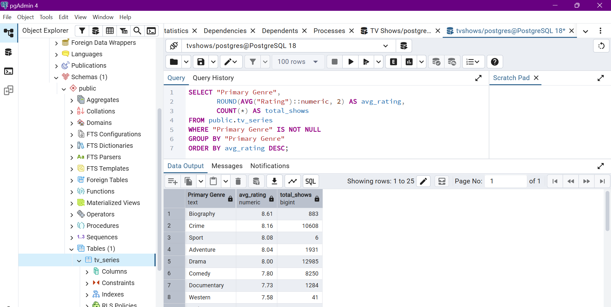
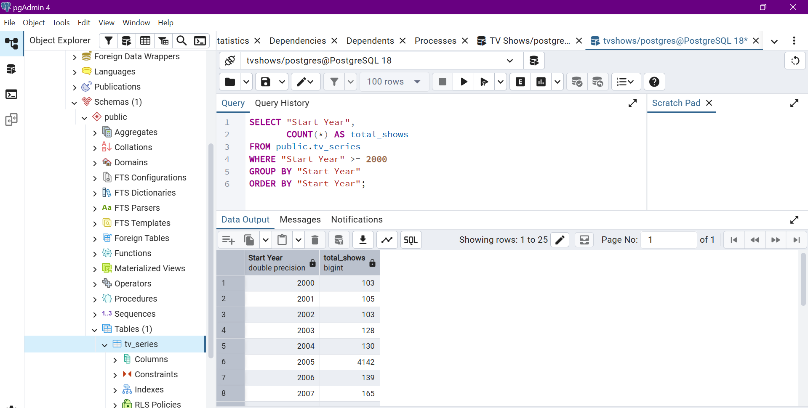
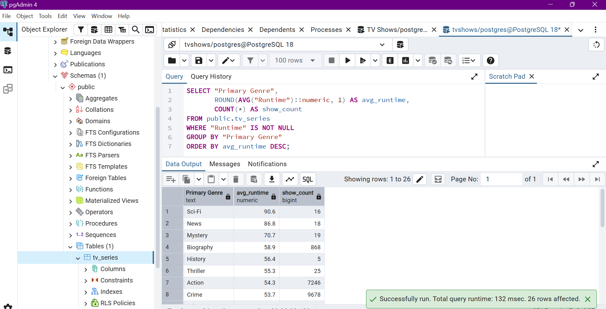
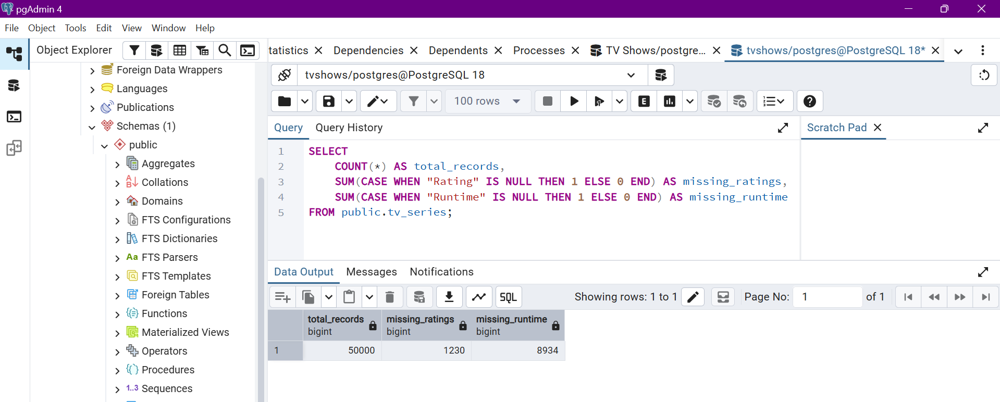
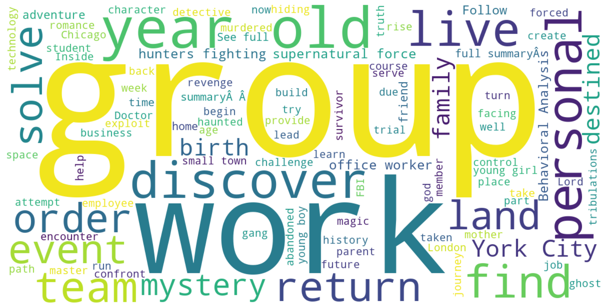
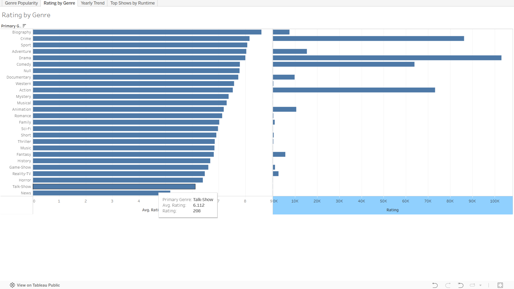

# TV Series Data Analysis 📊

End-to-end data analytics project on 50,000+ TV series records.

## Tech Stack
Python · Pandas · NumPy · SQL · PostgreSQL · Tableau Public · WordCloud

## Steps
1. Data cleaning & transformation — Python (Pandas, NumPy)
2. Data validation & quality checks — missing values, type fixes
3. SQL analysis — aggregation queries on PostgreSQL
4. NLP text analysis — WordCloud from synopsis data
5. Interactive dashboard — Tableau Public

## Key Insights
- Drama is the most common genre
- Crime & Documentary have highest avg ratings
- Show releases peaked post-2015
- Most shows run between 40–60 mins

## Screenshots
### Analysis Charts

### Word Cloud

### Tableau Dashboard

## Live Dashboard
[View on Tableau Public](https://public.tableau.com/shared/NBB7S39TY?:display_count=n&:origin=viz_share_link)

## Dataset
[Kaggle TV Series Dataset](https://www.kaggle.com/datasets/muralidharbhusal/50000-imdb-tv-and-web-series)